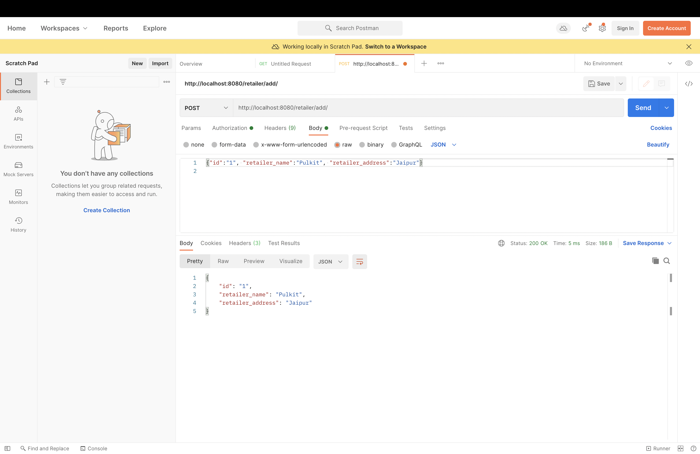
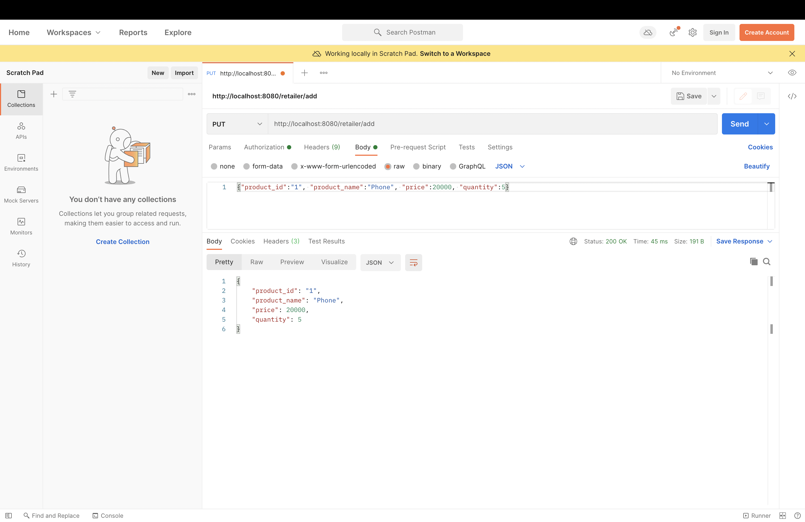
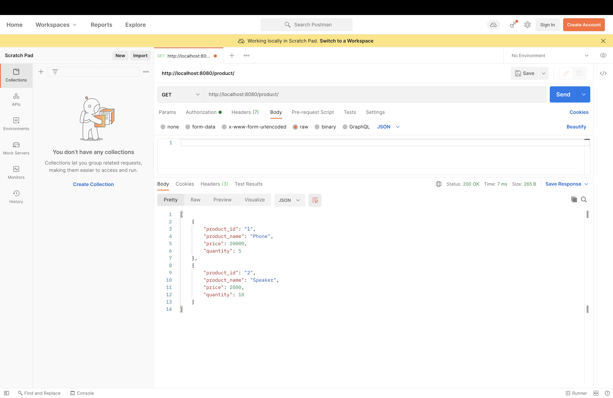
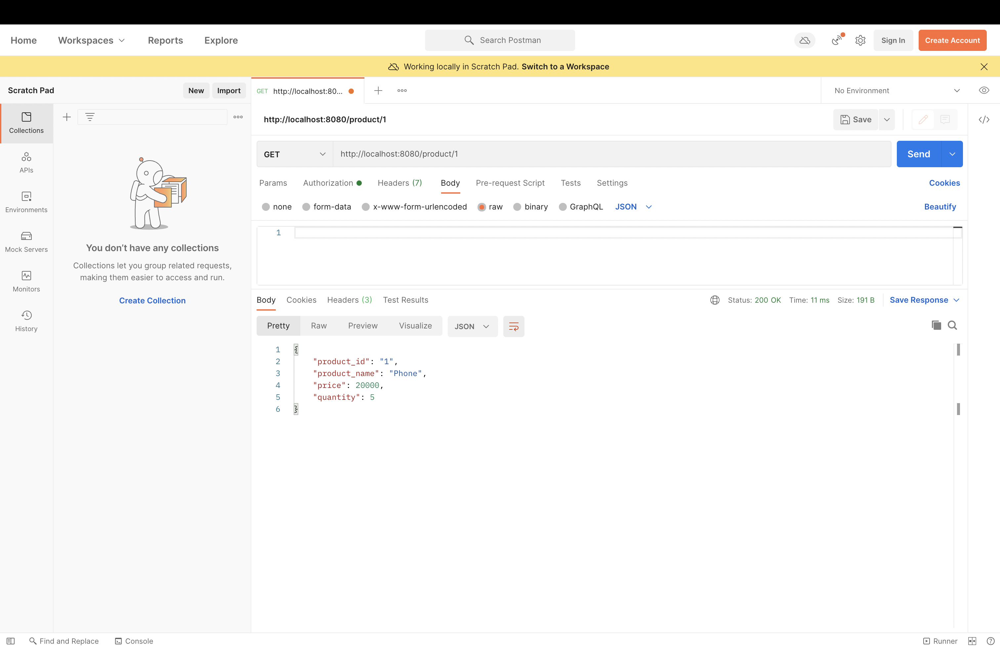
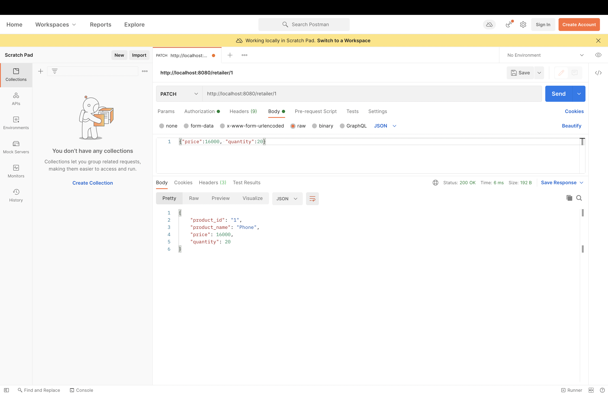
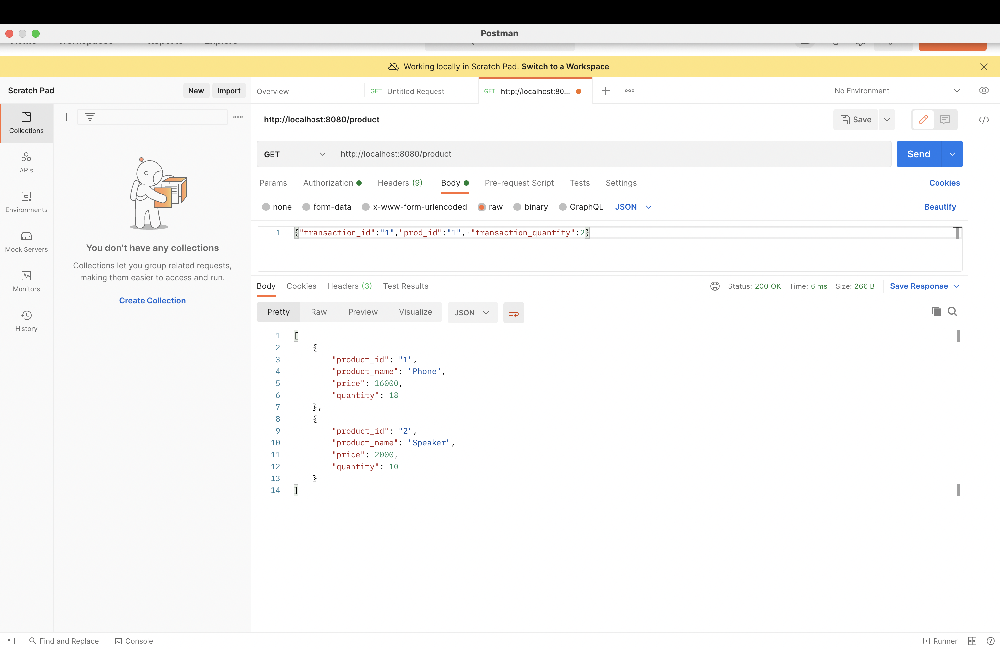
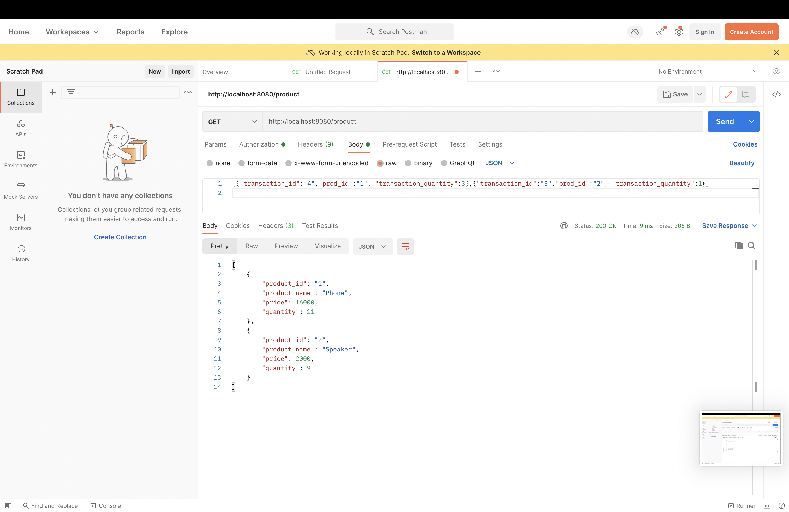

# eCommerce_API

An API was built for an e-commerce site using Gin and Gorm Framework in Golang.

To add the repository to your system, paste this in terminal at an appropriate location: https://github.com/Mayank-CES/eCommerce_API.git

Basic Authentication has been used for the api which is in the Config section. The Authenticated username and password is set as mayank and passes respectively.

## Sections 

1. Main.go

2. Config

3. Routes

4. Controllers 

5. Services

6. Repository

7. Models

8. Mutex

9. Test

## Functions 

1. ADD CUSTOMER				

	POST : http://localhost:8080/customer/add/

	Input : {“customer_id":"1", "customer_name":"Mayank", “customer_address”:"Delhi"}
	
	

2. ADD RETAILER
		
	POST : http://localhost:8080/retailer/add/

	Input : {“id":"1", "retailer_name":"Pulkit", “retailer_address":"Jaipur"}
	
	

3. ADD PRODUCT			

	POST : http://localhost:8080/retailer/add/
	
	Input 1 : {“product_id”:"1", "product_name":"Phone", "price":20000, “quantity":5}

	

	Input 2 : {“product_id”:"2", "product_name":"Speaker", "price":2000, “quantity”:10}

	

4. GET ALL PRODUCTS

	GET : http://localhost:8080/product/
	
	

5. GET PRODUCT BY ID		

	GET : http://localhost:8080/product/1
	
	

06 PATCH PRODUCT		

	PATCH : http://localhost:8080/retailer/1

	Input : {"price":16000, "quantity":20}
	
	

07 BUY PRODUCT

	PATCH : http://localhost:8080/customer/

	Input : {"transaction_id":"1","prod_id":"1", "transaction_quantity":2}
	
	

08 BUY MULTIPLE PRODUCTS

	PATCH : http://localhost:8080/customer/multiple/

	Input : [{“transaction_id":"4","prod_id":"1", "transaction_quantity":3},{"transaction_id":"5","prod_id":"2", “transaction_quantity":1}]
	
	

